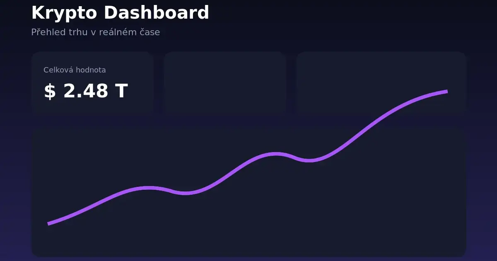

<div align="center">



# Marek Maněk — osobní portfolio

**Moderní jednostránkové portfolio webového vývojáře a UX/UI designéra.**  
Od prvního návrhu přes responzivní frontend až po nasazení na Netlify.

[](https://developer.mozilla.org/docs/Web/HTML)
[](https://tailwindcss.com/)
[](https://developer.mozilla.org/docs/Web/JavaScript)
[](https://vite.dev/)
[](https://www.netlify.com/)

[Repozitář](https://github.com/marekcze12/marekmanek.portfolio) · [Nahlásit problém](https://github.com/marekcze12/marekmanek.portfolio/issues) · [Kontakt](mailto:marek.manek.web@gmail.com)

</div>

## O projektu

Portfolio představuje moji práci, technologie a služby v oblasti webdesignu, UX/UI a frontendového vývoje. Vzniklo jako lehký web bez frontendového frameworku, abych měl plnou kontrolu nad strukturou, styly, přístupností i výkonem.

Design staví na tmavém vizuálním stylu, fialové paletě a vlastním technologickém motivu **MM**. Obsah je zaměřený na živnostníky, malé firmy a jednotlivce, kteří potřebují moderní webové stránky.

## Co portfolio obsahuje

- responzivní rozložení od malých mobilů po široké monitory,
- přístupnou navigaci včetně mobilního menu a ovládání klávesnicí,
- sekce O mně, Služby, Dovednosti, Projekty a Pracovní proces,
- projektové karty generované z jednoho datového souboru,
- kontaktní formulář připravený pro Netlify Forms,
- vlastní českou validaci formuláře a přístupná stavová oznámení,
- jemné animace respektující `prefers-reduced-motion`,
- SEO metadata, Open Graph, Twitter Card a JSON-LD,
- optimalizované náhledy ve formátu WebP,
- bezpečnostní hlavičky nastavené pro Netlify.

## Použité technologie

| Oblast | Technologie |
| --- | --- |
| Struktura | HTML5, sémantické HTML |
| Vzhled | Tailwind CSS, vlastní CSS, mobile-first přístup |
| Interakce | Vanilla JavaScript ES6+, modulární JS |
| Vývoj | Node.js, npm, Vite |
| Verzování | Git, GitHub |
| Hosting | Netlify, Netlify Forms |

## Spuštění na počítači

Budete potřebovat [Node.js](https://nodejs.org/) ve verzi **20.19+** nebo **22.12+** a npm.

```bash
git clone https://github.com/marekcze12/marekmanek.portfolio.git
cd marekmanek.portfolio
npm install
npm run dev
```

Vite zobrazí lokální adresu, obvykle:

```text
http://localhost:5173
```

## Produkční build

```bash
npm run build
```

Hotová produkční verze vznikne ve složce `dist/`. Zkontrolovat ji můžete příkazem:

```bash
npm run preview
```

## Struktura projektu

```text
marekmanek.portfolio/
├── public/
│   ├── images/projects/       # náhledy jednotlivých projektů
│   ├── favicon.svg
│   └── og-image.webp
├── src/
│   ├── data/projects.js       # obsah projektových karet
│   ├── modules/
│   │   ├── animations.js
│   │   ├── contact-form.js
│   │   └── navigation.js
│   ├── main.js
│   └── style.css
├── index.html
├── netlify.toml
├── package.json
├── postcss.config.js
└── tailwind.config.js
```

## Úprava obsahu

| Co chcete změnit | Soubor |
| --- | --- |
| Osobní texty, služby a kontakt | `index.html` |
| Projekty, technologie a odkazy | `src/data/projects.js` |
| Barvy, komponenty a responzivita | `src/style.css` |
| Tailwind konfigurace | `tailwind.config.js` |
| Náhledy projektů | `public/images/projects/` |
| Navigace a mobilní menu | `src/modules/navigation.js` |
| Validace formuláře | `src/modules/contact-form.js` |

Projektové náhledy používají názvy:

```text
jessica-egypt.webp
krypto-dashboard.webp
vspj-editorial-system.webp
```

Doporučený rozměr obrázků je **1200 × 750 px**.

## Kontaktní formulář

Formulář využívá Netlify Forms a nevyžaduje vlastní backend. Obsahuje skryté pole `form-name`, honeypot ochranu `bot-field`, klientskou validaci a blokování opakovaného odeslání během zpracování.

Na lokálním vývojovém serveru se zprávy do Netlify neukládají. Formulář začne plně fungovat po nasazení projektu na Netlify.

## Nasazení na Netlify

1. V Netlify vyberte **Add new site → Import an existing project**.
2. Propojte GitHub a zvolte repozitář `marekcze12/marekmanek.portfolio`.
3. Použijte build command `npm run build`.
4. Jako publish directory nastavte `dist`.
5. Spusťte nasazení.

Tyto hodnoty jsou připravené také v souboru `netlify.toml`. Po prvním nasazení nahraďte v `index.html` adresu `https://www.vase-domena.cz/` skutečnou URL portfolia.

## Kontakt

- **E-mail:** [marek.manek.web@gmail.com](mailto:marek.manek.web@gmail.com)
- **GitHub:** [@marekcze12](https://github.com/marekcze12)
- **LinkedIn:** [Marek Maněk](https://www.linkedin.com/in/marek-man%C4%9Bk-5a9947339/)
- **Lokalita:** Břeclav, Česká republika

---

<div align="center">

Navrženo a vytvořeno Markem Maňkem.

</div>
